import { LinkCard } from "@astrojs/starlight/components";
import { CardGrid } from "@astrojs/starlight/components";
import { Aside } from "@astrojs/starlight/components";

## Download the Launcher

The Bob-Ddong-Iri-Hoyo launcher is distributed as a DMG file on the GitHub Releases page.
In most cases, choose the latest release shown at the top and download the `.dmg` or `.zip` file.

<CardGrid>
  <LinkCard
    title="Download the latest Stable version"
    description="Download the DMG from GitHub Releases."
    href="https://github.com/Bob-Ddong-Iri-Hoyo/BDIH-Launcher/releases"
  />
  <LinkCard
    title="Download the Staging version"
    description="Download a test version. It may be unstable."
    href="https://github.com/Bob-Ddong-Iri-Hoyo/BDIH-Launcher-TestProduction/releases"
  />
  <LinkCard
    title="Download the Nightly version"
    description="Download the Nightly version. It may be unstable."
    href="https://github.com/Bob-Ddong-Iri-Hoyo/BDIH-Launcher-nightly/releases"
  />
</CardGrid>

## Installation Guide

The steps below assume you downloaded a DMG file.
Replace the example paths with your actual download location and file name.

### 1. Install Rosetta 2

<Aside type="note">
Rosetta 2 may be required to run x86_64-based components on Apple Silicon Macs.
If Rosetta 2 is already installed, you can skip this step.
</Aside>

```zsh
softwareupdate --install-rosetta --agree-to-license
```

After running the command, macOS will install Rosetta 2.
If it is already installed, the command may finish without making any visible changes.

### 2. Remove the Quarantine Tag

<Aside type="caution">
This project's distributed files may not be signed or notarized with an Apple developer certificate.
If you run them in that state, macOS Gatekeeper may block the app or show it as damaged.
</Aside>
<div align="center">

</div>
macOS adds a quarantine tag to files downloaded from the internet.
The tag is used for security checks, but for a non-notarized app from a personal project, it can prevent the app from launching.
Open Terminal, iTerm, or another terminal app and remove the quarantine tag from the downloaded DMG file with the command below.

```zsh
xattr -d com.apple.quarantine {save-location}/{downloaded-file-name}.(dmg|zip|app)
```

For example, if the file is in your Downloads folder, replace `{save-location}` with `~/Downloads`.
If you see a message similar to `No such xattr`, it means the file does not have a quarantine tag to remove.

### 3. Install the Launcher

After removing the quarantine tag, double-click the downloaded DMG file in Finder.
When the DMG is mounted, move the launcher app to the `Applications` folder as instructed, or follow the installation method provided by the distribution file.

The first time you launch the app, macOS may show another confirmation prompt.
In that case, allow the app in System Settings under Privacy & Security, or Control-click the app in Finder and choose Open.

## App Setup and Game Installation
<div align="center">
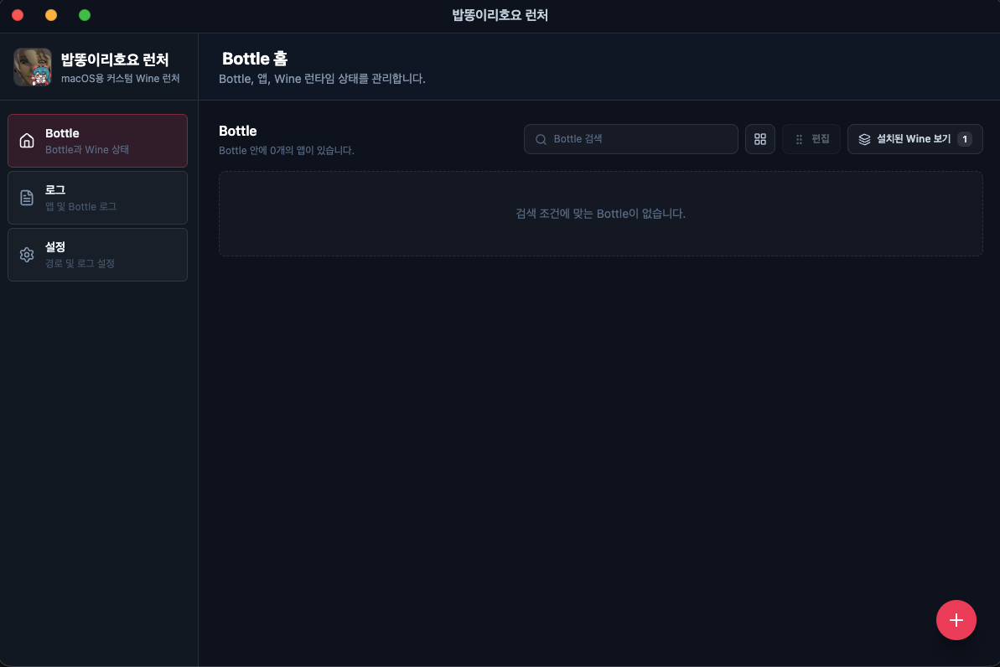
</div>
After launching the app and waiting for the initial loading to finish, the Bottle list screen appears.
A Bottle is an isolated runtime environment used by Wine, where Windows programs and their related settings are stored separately.
<div align="center">
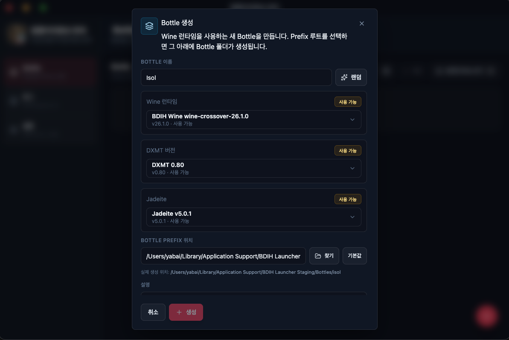
</div>
To create a new Bottle, click the **+** button in the lower-right corner, then choose the Wine version and DXMT version to use.
If there is a recommended combination for a specific game, use that first and only switch versions when problems occur.
<div align="center">
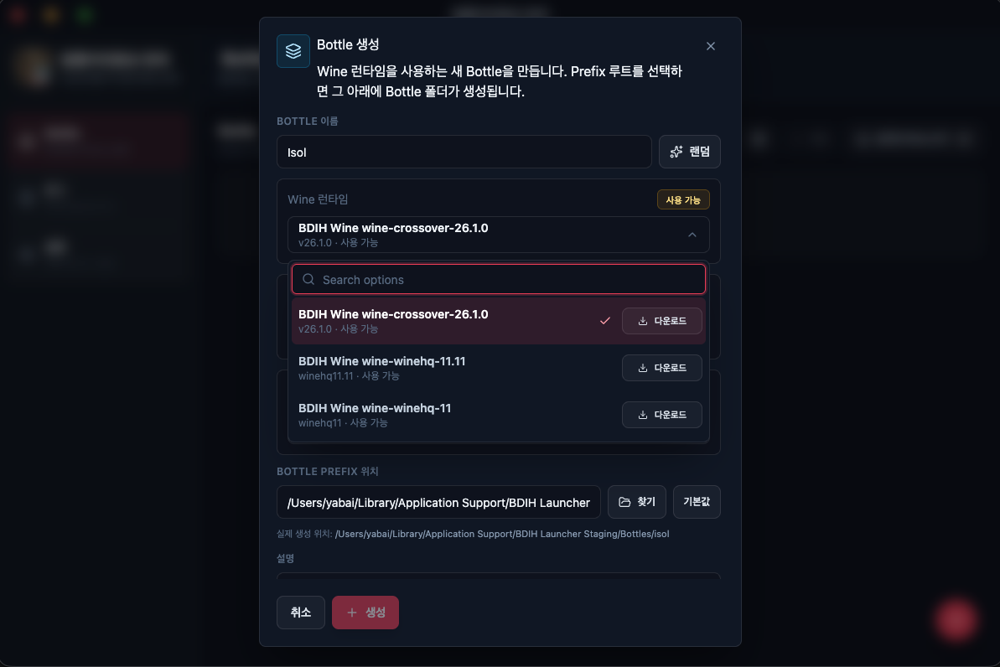
</div>
<Aside type="tip">
For Eternal Return, Wine11 or wine-crossover-26.1.0 is recommended.

For HoYoverse games, only Wine 11 and Wine 11.11 work.
</Aside>
<div align="center">
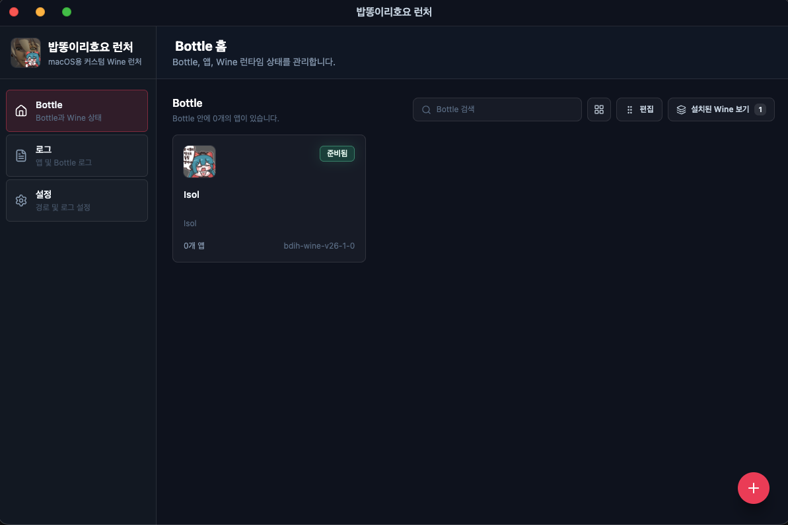
</div>
The Bottle has been created.

<div align="center">
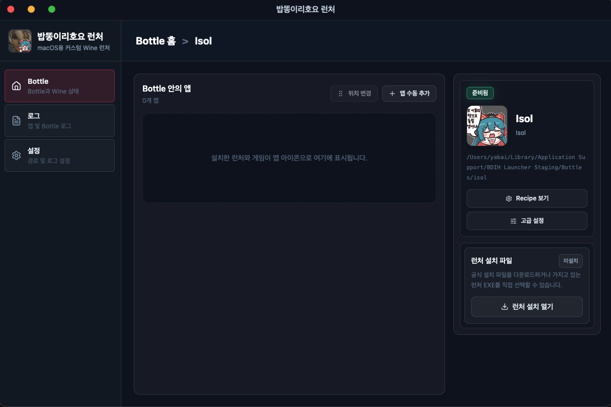
</div>
Click the Bottle to open the following screen.

<div align="center">
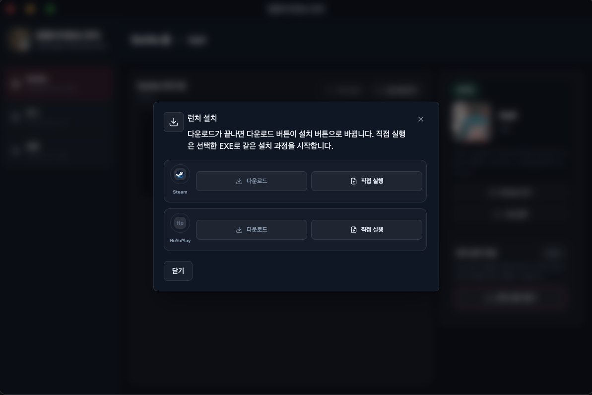
</div>
Click the launcher installation menu to see the Steam and HoyoPlay installation list. Download the program you want.
<div align="center">
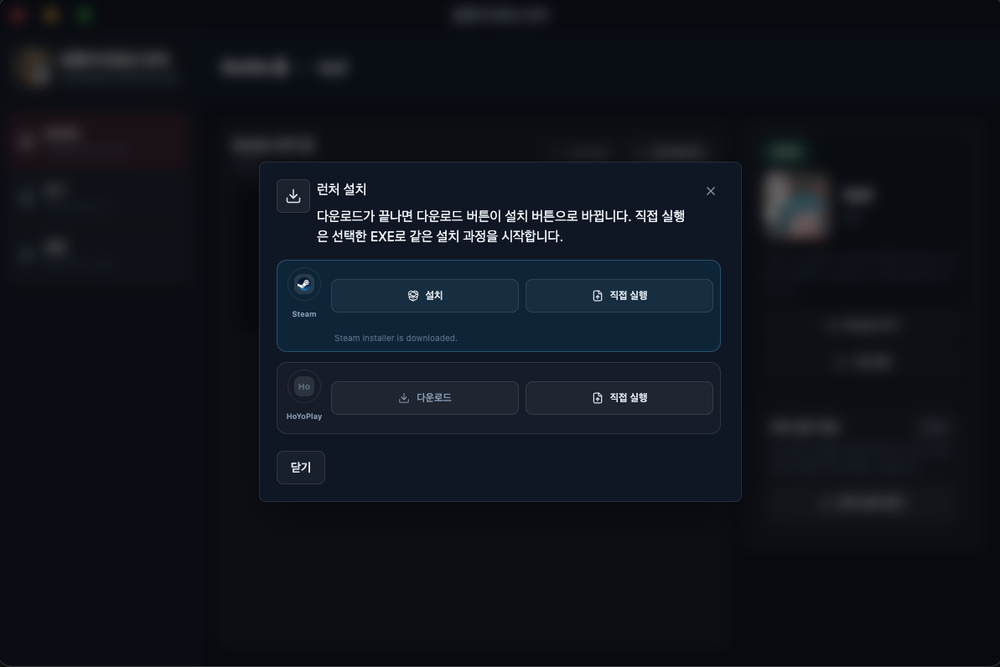
</div>
When the download finishes, the download button changes into an install button.
<div align="center">
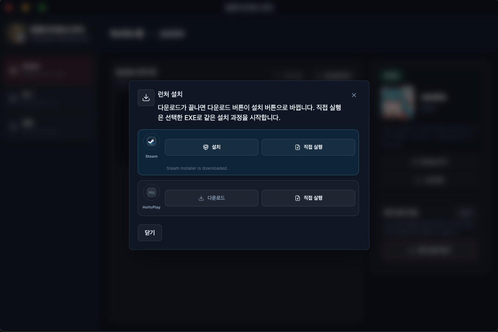
</div>
Click install and wait for a moment.
<div align="center">
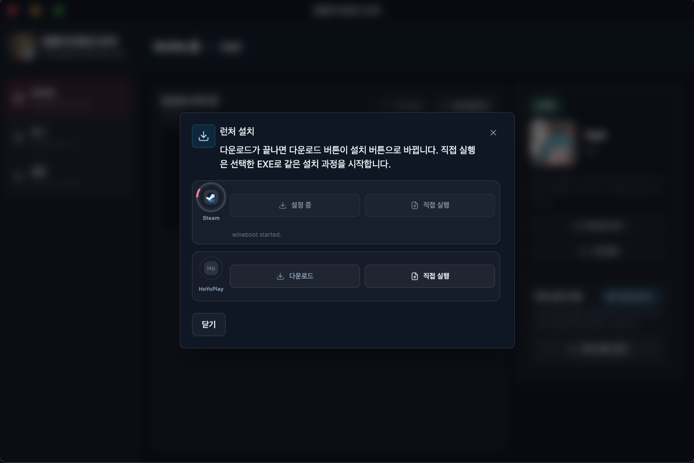
</div>
<div align="center">
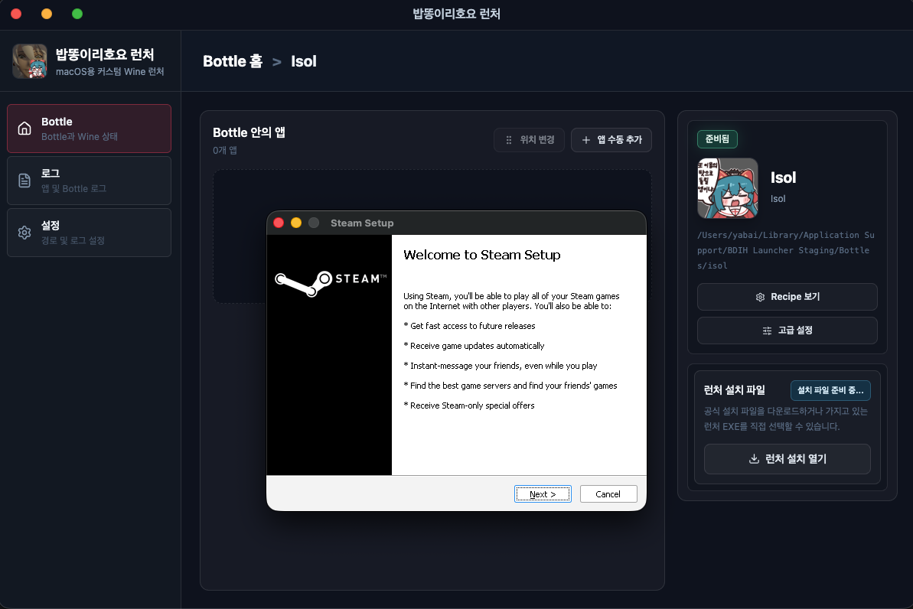
</div>
When the Steam installer opens, click Next and proceed with the installation.
<div align="center">
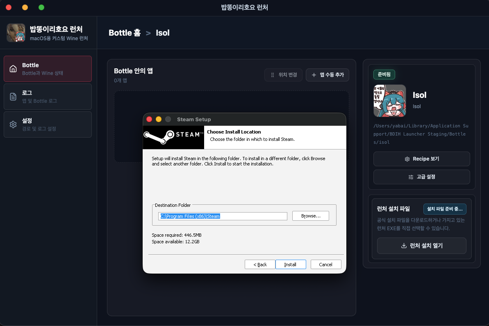
</div>
You can keep the default installation location.
<div align="center">
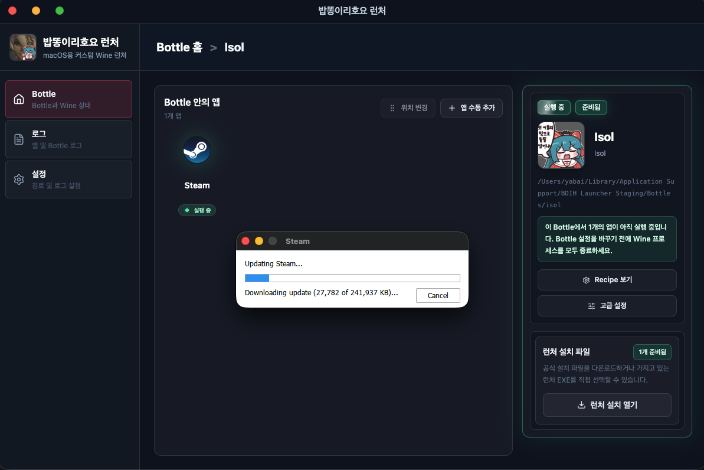
</div>
After installation completes, the Steam login screen appears.

<div align="center">
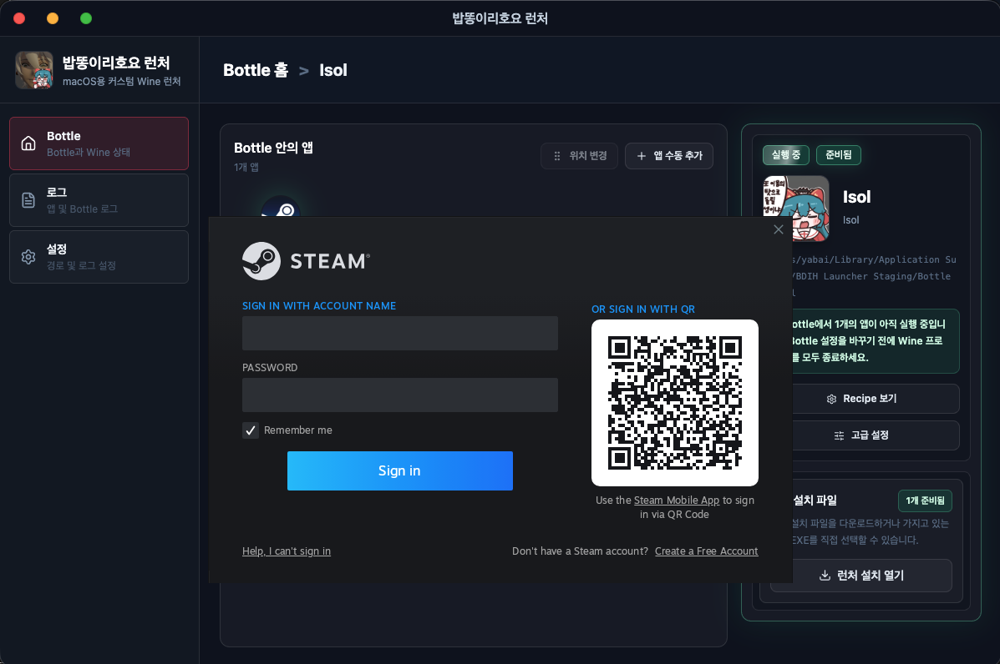
</div>
The Bob-Ddong-Iri-Hoyo launcher provides a G: drive interface for storing large games.
In Steam settings, you can add the G: drive through Add drive and move your Steam games there.
This lets you keep downloaded Steam games even if you delete an existing Bottle.
<div align="center">
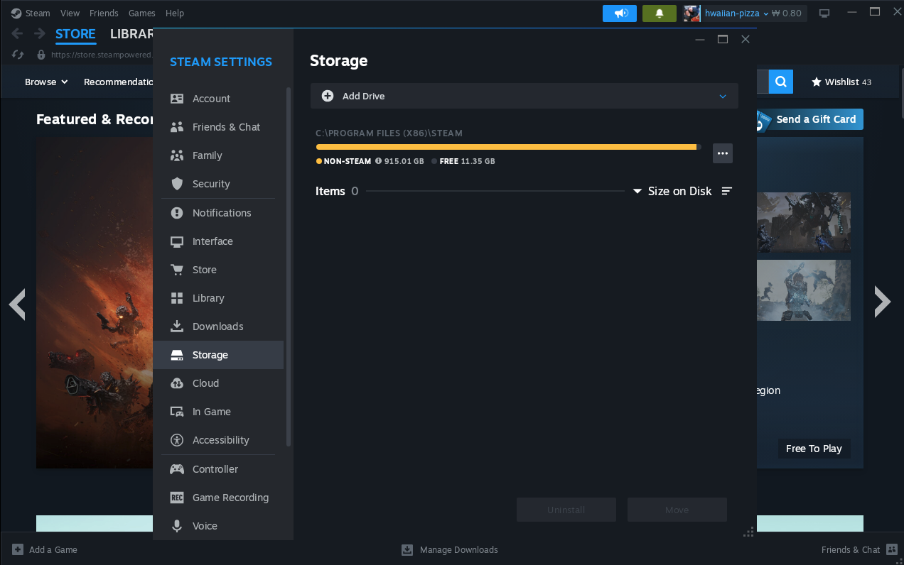
</div>
In Steam settings, add the G: drive from storage using Add drive.
<div align="center">
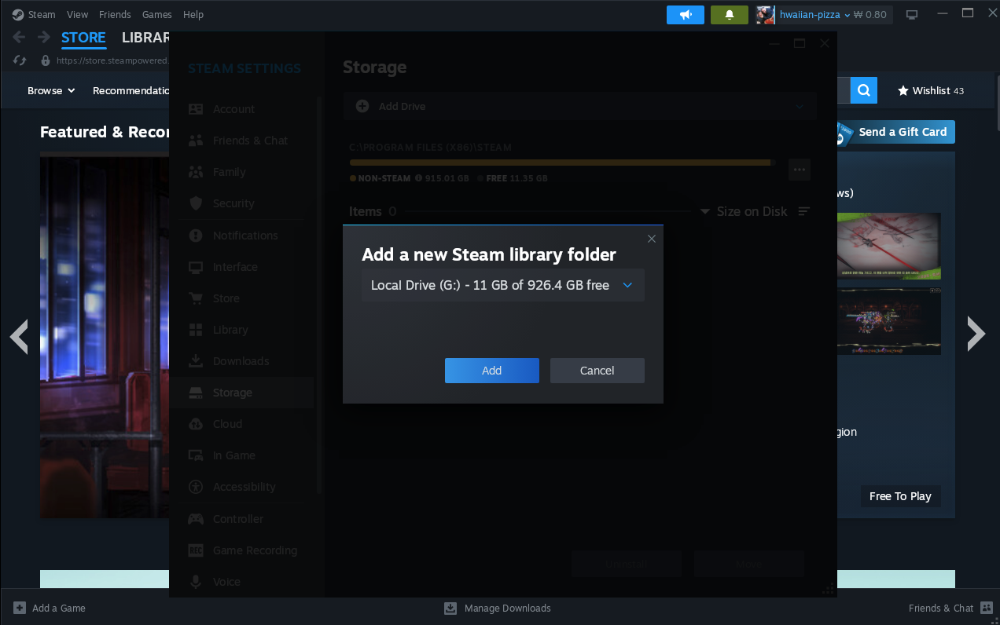
</div>

You can adjust the G: Drive location in the Bob-Ddong-Iri-Hoyo launcher settings.
Choose your preferred location or use the default path provided by the launcher.
<div align="center">
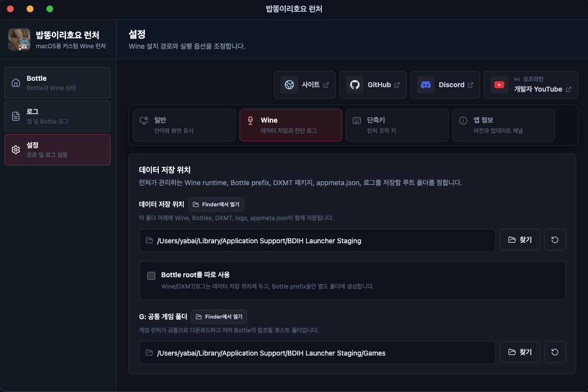
</div>

<Aside type="caution">
All games may stutter a little on the first launch.
This is a natural result of DXMT or Rosetta 2 building caches.
After caching is complete, the stuttering should disappear.
For that reason, if you are launching Eternal Return for the first time, starting with ranked play immediately is not recommended.
</Aside>

<Aside type="tip">
The Bob-Ddong-Iri-Hoyo launcher mainly targets Eternal Return and HoYoverse games.
It does not guarantee successful launch or stability for every other Steam game.

Issues in games outside the supported scope are outside the intended support range.
Before reporting a problem, first check whether the game is within the project's supported targets.
</Aside>

<div align="center">

</div>
