import { LinkCard } from "@astrojs/starlight/components";
import { CardGrid, Card } from "@astrojs/starlight/components";
import { Aside } from "@astrojs/starlight/components";

## 0. 와인 선택 가이드

호요버스 게임은 BDIH에서 제공하는 winehq 계열 와인이 호환됩니다. 하지만 선택하는 버전마다 성능에 미세한 차이가 존재할 수 있습니다.

<div className="version-row">
  <Card
    title="🔴 wine-crossover-26.1.0"
  >
  오직 이터널리턴만을 위한 와인입니다. 이터널 리턴만을 위해 패치되어 있습니다. 따라서 Hoyoverse 게임들과 호환되지 않습니다.
  </Card>

<Card title="🟢 wine-winehq-11.11">
호요버스 게임 global용 붕괴:스타레일, 원신, 젠리스 존 제로 실행이 호환됩니다.
</Card>
  <Card
    title="🟢 wine-winehq-11"
  >
  호요버스 게임 global용 붕괴:스타레일, 원신, 젠리스 존 제로 실행이 호환됩니다.
  </Card>
</div>

## 1. HoyoPlay 설치 가이드
### 기본적인 설치

<div align="center">
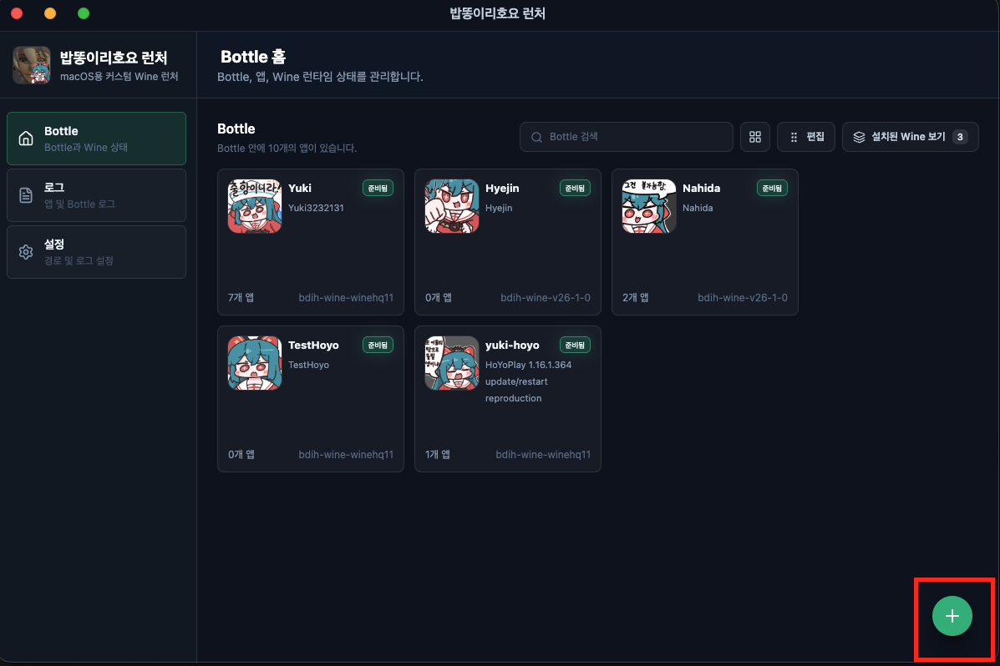
</div>
우측 하단의 +버튼을 눌러서 Bottle을 만들어준다.
<div align="center">
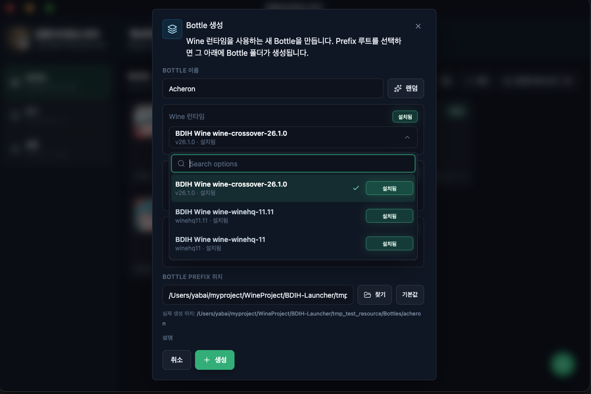
</div>
여기서 원하는 와인을 선택해준다.(DXMT, Jadeite는 선택의 여지가 없으니 기본값 다운로드)
그리고 생성버튼을 눌러 Bottle을 생성한다.
<div align="center">
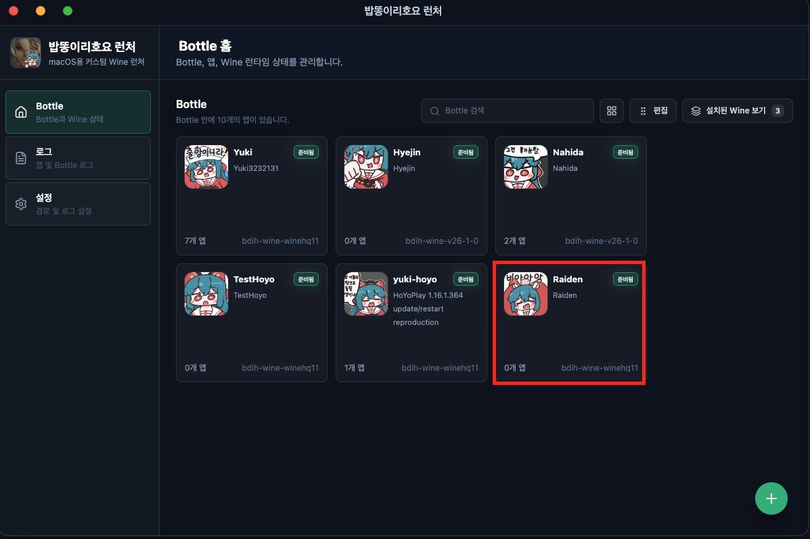
</div>
이제 우리가 생성한 Bottle을 열어준다.
<div align="center">
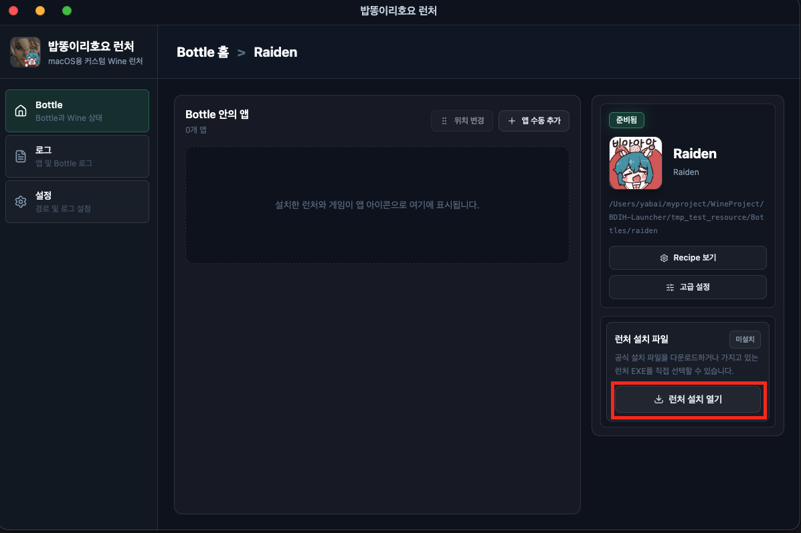
</div>
Bottle에 들어가면 우측하단의 런처 설치 열기를 눌러서 Hoyoplay런처를 설치해 줄 것이다.
<div align="center">
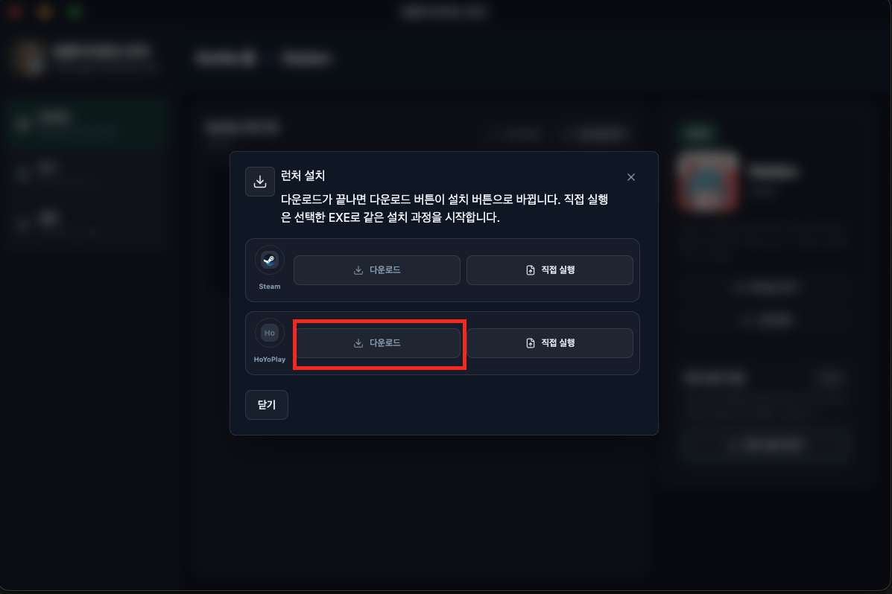
</div>
아직 런처가 없기 때문에 런처를 다운로드한다.
<Aside type="caution">
직접 실행은 Hoyoplay 사이트에서 hoyoplayInstaller.exe를 직접 다운받아서 실행시키는 것입니다. 다운로드와 설치가 제대로 되지 않을 때만 직접 사용하는 것을 
권장하고 hoyoplay 인스톨러 이외의 프로그램을 저것으로 직접 실행시키면 의도하지 않은 결과가 발생할 수 있습니다. 이 경우에는 그 Bottle을 사용하지
못하게 될 수 있습니다. 실수로라도 잘못 실행시켰다면 Bottle을 삭제하고 새로 Bottle 환경을 구성해야합니다.
</Aside>
<div align="center">
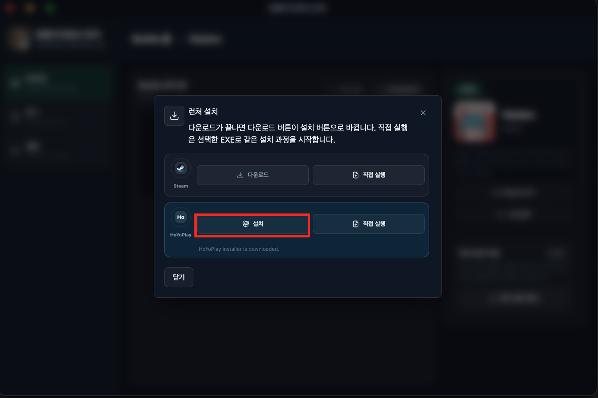
</div>
다운로드가 완료된다면 설치 버튼을 눌러준다.
<div align="center">
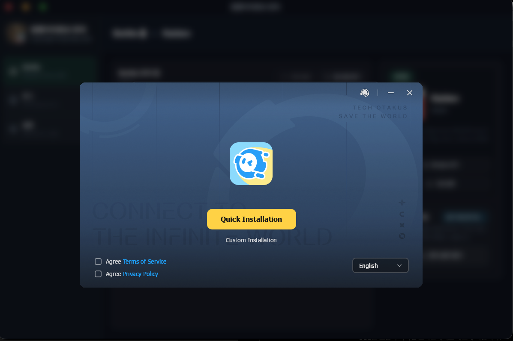
</div>
약간 시간이 걸리는 작업이므로 기다리다보면 hoyoplay 설치창이 그림과 같이 열린다. 여기서 우리는 빠른설치(Quick Installation)을 선택하여 기본값으로 해서 모두 다음을 눌러서 설치를 마무리 해준다.

<div align="center">
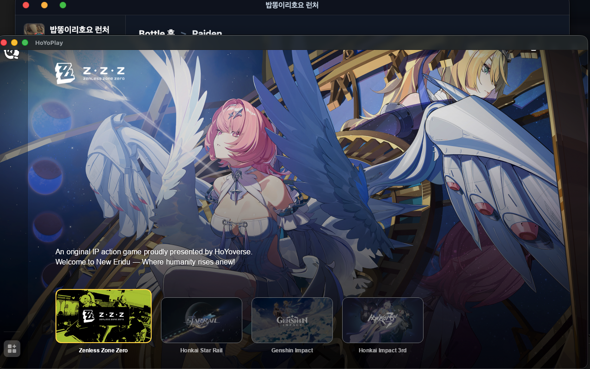
</div>
이제 제대로 설치가 되었다면 자동으로 다음과 같은 Hoyoplay 런처 창이 뜨게 될 것이다. 이제 원하는 게임을 선택해서 설치하고 실행하면 된다.

### 추가적인 설치 팁
Bottle을 삭제하게 된다면 그 안에 있는 게임 역시 삭제된다. 용량이 큰 호요 게임 특성상 다시 설치하는 것은 굉장한 시간낭비다. 따라서 우리는 G: Drive라는 것을 제공한다.
G: Drive에 설치된 게임은 사용자가 직접 삭제하지 않는 한 영구 보존된다. 따라서 Bottle의 삭제 유무와 별개로 게임을 관리할 수 있다.

G: Drive는 ```설정>Wine```에서 저장 위치를 변경하거나 관리할 수 있다.
<div align="center">

<p>G: drive 설정창</p>
</div>

<div align="center">
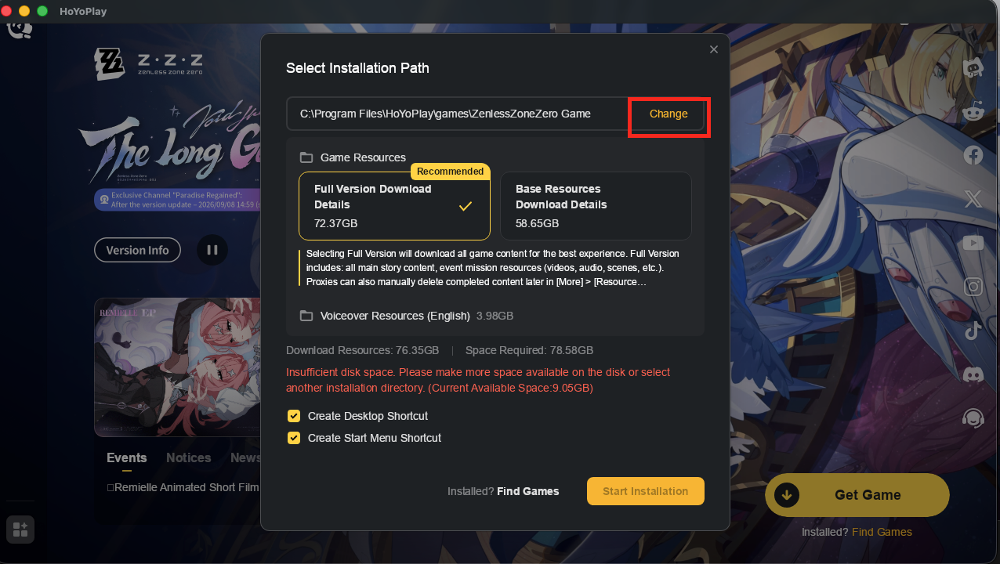
</div>
게임을 G: Drive에 설치하는 방법은 다음과 같다. 원하는 게임을 설치버튼을 누르고 설치 장소를 변경하는 버튼을 눌러준다.

<div align="center">
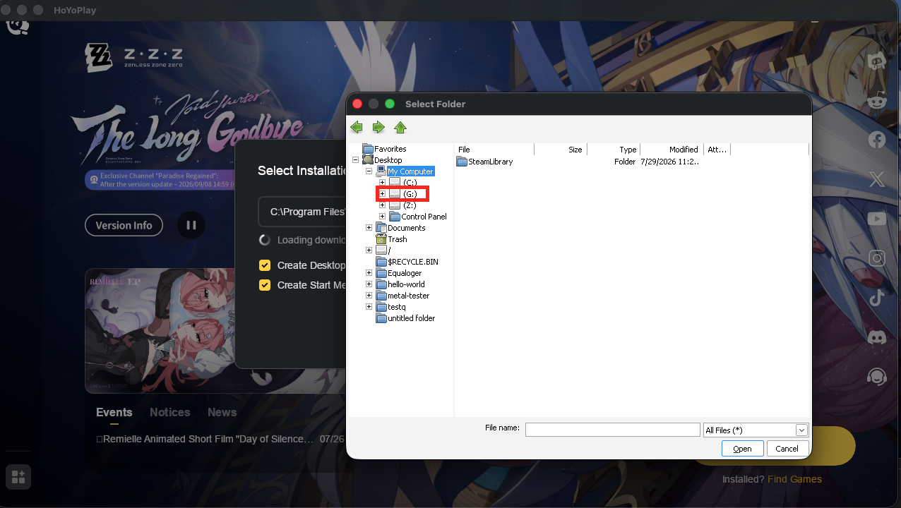
</div>
```MyComputer>G:```를 선택하고 그 안에 적절한 폴더를 만들던가 해서 설치하면 된다. 
폴더는 여기서 직접 만들 수 없음. 이건 와인 자체 구현 문제인 것 같다. 설정에 들어가서 그 위치에 필요한 폴더를 따로 생성해주면 된다.


## 2. 설정 가이드

### 1 호요 플레이 설정 가이드 
  **60** fps를 맞춰야만 hoyoplay 런처의 애니메이션이 안찢어져 보입니다. 기본적으로 이 옵션은 켜저있어서 크게 신경쓰지 않아도 됩니다.
  혹여 이 문제가 발생한다면 한번쯤 ```Launch 옵션>DXMT>Fps 제한```이 **60** fps인지 확인해 보는 것을 추천합니다.

### 2 원신 설정 가이드 
Msync 옵션은 사용자의 선택에 따라서 키거나 끌 수 있습니다. 경험적으로 판단했을때 큰 차이를 보이지는 않았지만 느리다고 느낀다면 키는 것을 추천합니다.

### 3 붕괴:스타레일 설정 가이드 

import glitching from "../../../assets/starrail/glitching.mp4";
import fix from "../../../assets/starrail/fix.mp4";
import options from "../../../assets/starrail/option.mp4";

일부 지역에서 반짝이는 글리칭 버그가 발생 할 수 있습니다. 이 문제가 발생한다면 조명 품질을 중간 이하로 바꾸면 해결됩니다.

<div align="center">
<video
  controls
  autoplay
  muted
  loop
  playsInline
  width="100%"
>
  <source src={glitching} type="video/mp4" />
</video>
<p>글리칭 버그 예시</p>
</div>

<div align="center">
<video
  controls
  autoplay
  muted
  loop
  playsInline
  width="100%"
>
  <source src={options} type="video/mp4" />
</video>
<p>해결책 : 조명 품질 중간 이하로 변경</p>
</div>

<div align="center">
<video
  controls
  autoplay
  muted
  loop
  playsInline
  width="100%"
>
  <source src={fix} type="video/mp4" />
</video>
<p>설정 결과</p>
</div>


<div align="center">
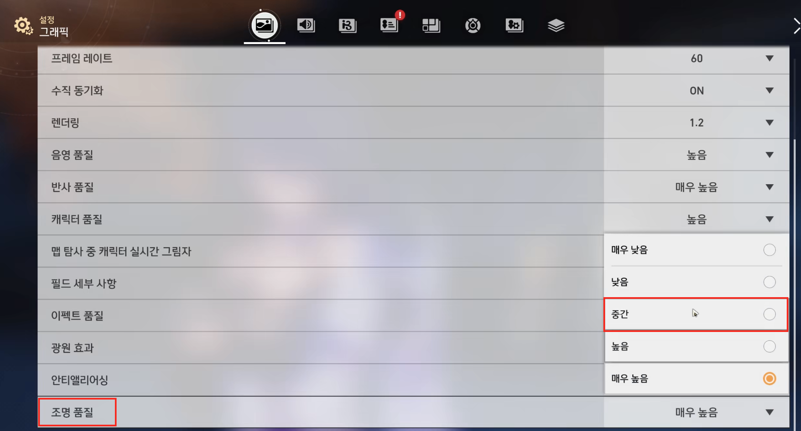
</div>
  


### 4 젠리스 존 제로 설정 가이드

Msync를 켜주는 걸 추천합니다.
매우 큰 버벅임을 경험할 수 있습니다.
이는 추측상 동적인 로딩을 많이 쓰는 것 때문인 것 같습니다. 이런 문제에서 Msync는 속도향상에 큰 도움이 됩니다.

게임을 키고 있다면 지금 사용중인 게임들을 종료하고 아래의 그림처럼 설정합니다.
<div align="center">
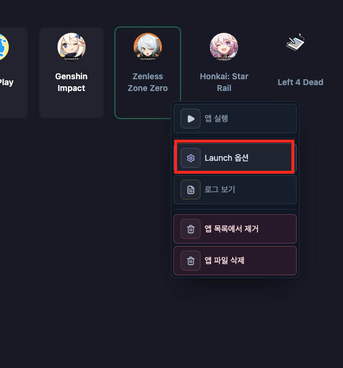
</div>

<div align="center">
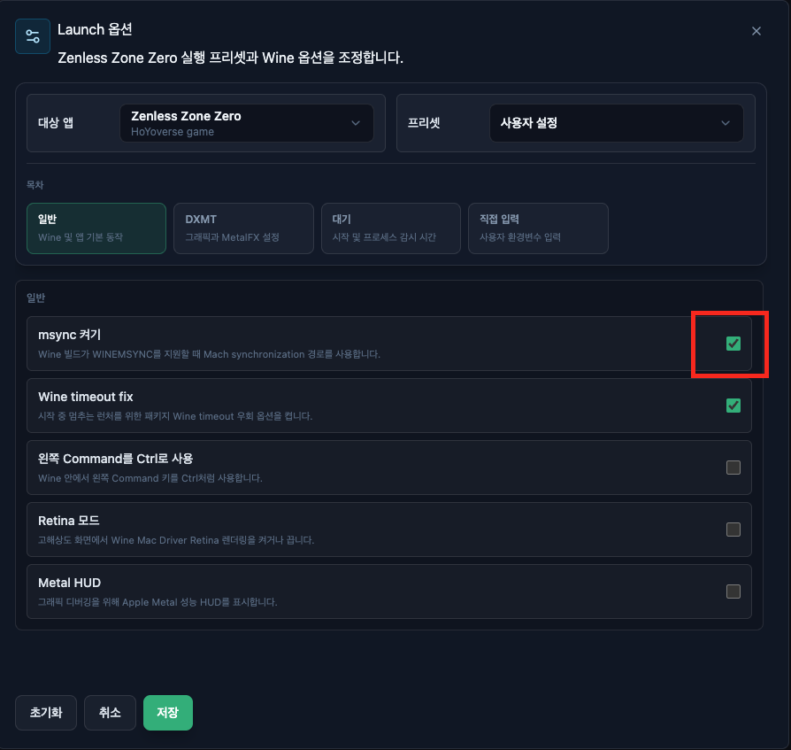
</div>

이제 다시 게임을 직접 실행하면 됩니다.
  


