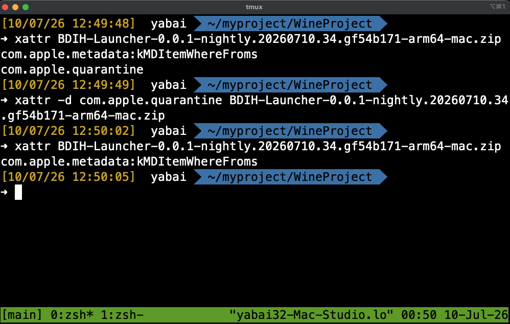

import { LinkCard } from "@astrojs/starlight/components";
import { CardGrid } from "@astrojs/starlight/components";
import { Aside } from "@astrojs/starlight/components";

## 런처 다운로드

밥똥이리호요 런처는 GitHub Releases 페이지에서 DMG 파일로 배포됩니다.
일반적으로 가장 위에 표시되는 최신 릴리스를 선택한 뒤,`.dmg`,`.zip` 파일을 다운로드하면 됩니다.

<CardGrid>
  <LinkCard
    title="최신 Stable 버전 다운로드"
    description="GitHub Releases에서 DMG를 다운로드합니다."
    href="https://github.com/Bob-Ddong-Iri-Hoyo/BDIH-Launcher/releases"
  />
  <LinkCard
    title="Staging 버전 다운로드"
    description="Nightly 버전을 다운로드합니다. 테스트 버전으로 작동이 불안정할 수 있습니다."
    href="https://github.com/Bob-Ddong-Iri-Hoyo/BDIH-Launcher-TestProduction/releases"
  />
  <LinkCard
    title="Nightly 버전 다운로드"
    description="Nightly 버전을 다운로드합니다. 테스트 버전으로 작동이 불안정할 수 있습니다."
    href="https://github.com/Bob-Ddong-Iri-Hoyo/BDIH-Launcher-nightly/releases"
  />
</CardGrid>

## 설치 가이드

아래 절차는 다운로드한 DMG 파일을 기준으로 설명합니다.
경로 예시는 사용자의 다운로드 위치와 실제 파일 이름에 맞게 바꿔 입력해야 합니다.

### 1. 로제타 2 설치하기

<Aside type="note">
Apple Silicon Mac에서 x86_64 기반 구성 요소를 실행하려면 Rosetta 2가 필요할 수 있습니다.
이미 Rosetta 2가 설치되어 있다면 이 단계는 건너뛰어도 됩니다.
</Aside>

```zsh
softwareupdate --install-rosetta --agree-to-license
```

명령 실행 후 macOS가 Rosetta 2 설치를 진행합니다.
설치가 이미 완료된 환경에서는 별도의 변화 없이 종료될 수 있습니다.

### 2. Quarantine Tag 제거하기

<Aside type="caution">
이 프로젝트의 배포 파일은 Apple 개발자 서명과 공증이 적용되지 않은 빌드일 수 있습니다.
그 상태로 실행하면 macOS Gatekeeper가 앱 실행을 차단하거나, 손상된 앱처럼 표시할 수 있습니다.
</Aside>
<div align="center">

</div>
macOS는 인터넷에서 내려받은 파일에 quarantine 태그를 붙입니다.
이 태그는 보안 확인을 위해 사용되지만, 개인 프로젝트의 미공증 앱에서는 실행을 막는 원인이 될 수 있습니다.
터미널(Terminal, iTerm 등)을 열고 아래 명령어로 다운로드한 DMG 파일의 quarantine 태그를 제거합니다.

```zsh
xattr -d com.apple.quarantine {저장위치}/{다운로드한-파일-이름}.(dmg|zip|app)
```

예를 들어 파일이 다운로드 폴더에 있다면 `{저장위치}`는 `~/Downloads`로 바꿔 입력합니다.
명령 실행 중 `No such xattr`와 비슷한 메시지가 표시된다면, 해당 파일에 제거할 quarantine 태그가 없다는 의미입니다.

### 3. 런처 설치

quarantine 태그를 제거한 뒤 Finder에서 다운로드한 DMG 파일을 더블 클릭합니다.
DMG가 마운트되면 안내에 따라 런처 앱을 `Applications` 폴더로 옮기거나, 배포 파일이 제공하는 설치 방식을 따르면 됩니다.

처음 실행할 때 macOS가 다시 한 번 확인 메시지를 표시할 수 있습니다.
이 경우 시스템 설정의 개인정보 보호 및 보안 항목에서 실행을 허용하거나, Finder에서 앱을 Control-클릭한 뒤 열기를 선택해 실행할 수 있습니다.

## 앱 설정 및 게임 설치
<div align="center">

</div>
앱을 실행하고 초기 로딩이 끝나면 Bottle 목록 화면이 표시됩니다.
Bottle은 Wine이 사용하는 독립 실행 환경을 의미하며, Windows 프로그램과 관련 설정이 이 공간 안에 분리되어 저장됩니다.
<div align="center">

</div>
새 Bottle을 만들려면 우측 하단의 **+** 버튼을 누른 뒤 사용할 Wine 버전과 DXMT 버전을 선택합니다.
특정 게임에 맞는 조합이 있다면 해당 조합을 우선 사용하고, 문제가 있을 때만 다른 버전으로 변경하는 것이 좋습니다.
<div align="center">

</div>
<Aside type="tip">
Eternal Return은 Wine11이나 wine-crossover-26.1.0를 사용하는 것을 추천합니다.

호요버스 게임의 경우 Wine 11, Wine 11.11만 동작합니다.
</Aside>
<div align="center">

</div>
Bottle이 생성되었습니다.

<div align="center">

</div>
Bottle을 클릭하면 다음과 같은 화면이 나옵니다.

<div align="center">

</div>
런처 설치 열기를 클릭하면 아래와 같이 Steam, HoyoPlay 설치 목록이 나옵니다. 원하는 프로그램을 
다운로드 합니다.
<div align="center">

</div>
다운로드가 완료되면 다운로드 버튼이 설치 버튼으로 변경됩니다.
<div align="center">

</div>
설치를 누르고 잠시 대기합니다.
<div align="center">

</div>
<div align="center">

</div>
스팀 인스톨러가 켜지면 다음 버튼을 누르고 설치합니다. 
<div align="center">

</div>
설치 위치는 기본값을 그대로 사용하면 됩니다.
<div align="center">

</div>
설치가 완료되면 스팀 로그인 화면이 나타나게 됩니다.

<div align="center">

</div>
밥똥이리호요 런처는 용량이 큰 게임을 저장하기 위한 G: drive 인터페이스를 제공합니다.
스팀의 설정에서 드라이브 추가를 통해서 G: drive를 추가하여 스팀의 게임을 그곳으로 옮겨 둘 수 있습니다.
이럴 경우 기존 Bottle을 지우더라도 받아놓은 스팀의 게임들을 다시 받지 않아도 됩니다.
<div align="center">

</div>
스팀 설정에서 storage에 Add drive를 통해서 G드라이브를 추가하면 됩니다.
<div align="center">

</div>

G: Drive는 밥똥이리호요 런처의 설정에서 위치를 조정할 수 있습니다. 
G: Drive는 자신이 원하는 위치를 설정하거나 기본적으로 제공하는 경로를 사용합니다.
<div align="center">

</div>


<Aside type="caution">
모든 게임은 첫 실행에서 약간의 Sttutering이 발생할 수 있습니다. 이것은 DXMT나 로제타2가
캐싱을 하는 과정에서 생기는 자연스러운 현상입니다. 캐싱이 완료되면 이후에는 이 현상은 사라지게 됩니다.
따라서 Eternal Return을 처음 실행했다면 첫 판부터 랭크를 돌리는 행위는 추천하지 않습니다.
</Aside>


<Aside type="tip">
밥똥이리호요 런처는 Eternal Return과 HoYoverse 게임 실행을 주된 목표로 합니다.
그 외의 모든 Steam 게임에 대해 실행 성공이나 안정성을 보장하지 않습니다.

지원 대상이 아닌 게임에서 문제가 발생하는 것은 의도된 지원 범위 밖의 동작입니다.
문제 제보를 하기 전에는 해당 게임이 프로젝트의 지원 대상인지 먼저 확인해야 합니다.
</Aside>


<div align="center">

</div>
