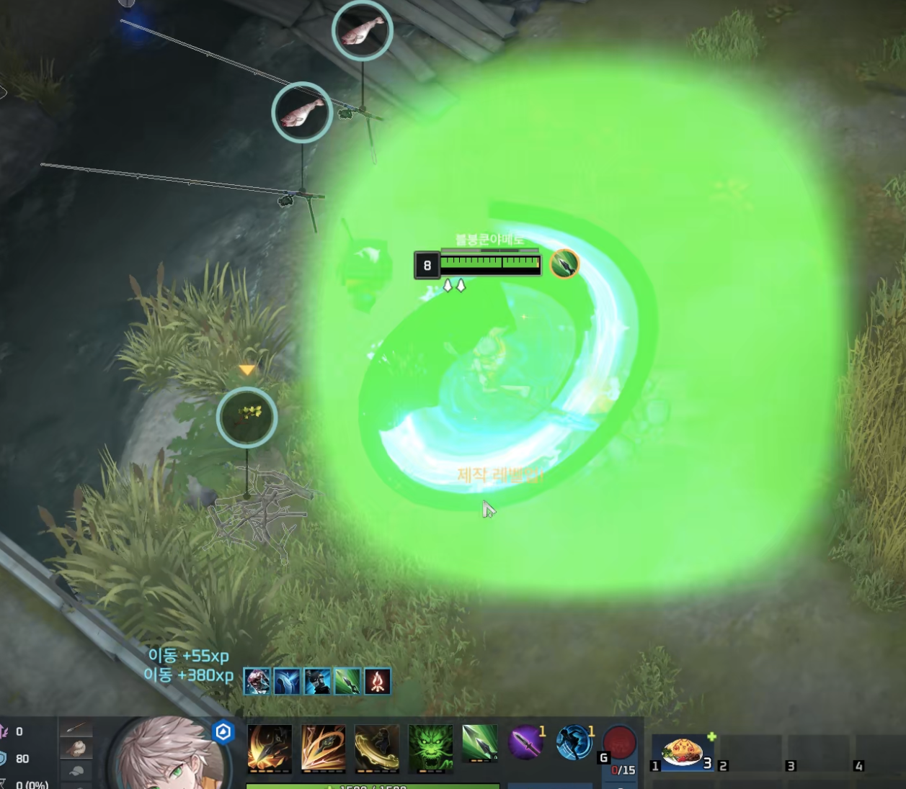
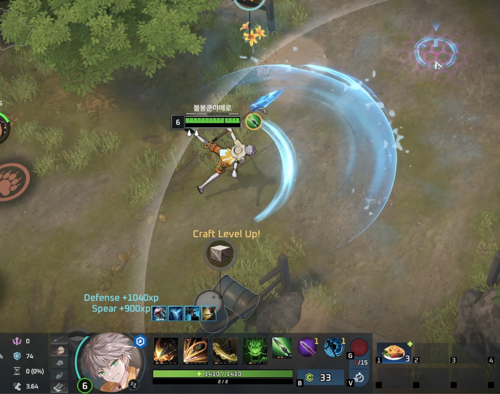
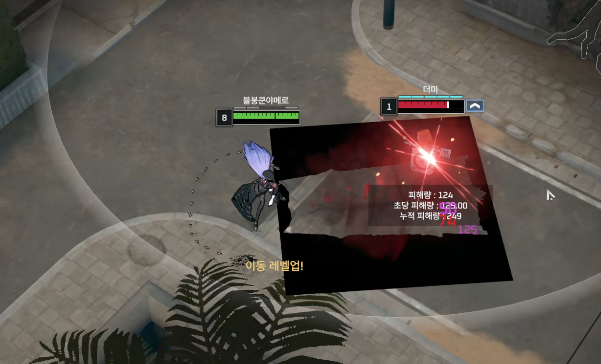
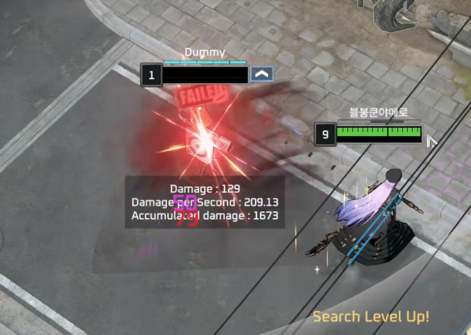

import { LinkCard, CardGrid, Card} from "@astrojs/starlight/components";
import { Aside } from "@astrojs/starlight/components";

## 밥똥이리호요란?

밥똥이리호요는 macOS에서 이터널 리턴과 HoYoverse 게임을 실행하기 위한 Wine 런처입니다.
내부적으로는 Wine 기반 실행 환경을 사용하며, Apple Silicon Mac에서는 Rosetta 2와 DXMT 같은 호환 계층이 함께 사용될 수 있습니다.

런처의 목적은 복잡한 Wine 명령어와 설정 파일을 직접 다루지 않아도 게임 실행에 필요한 Bottle, Wine 버전, 그래픽 변환 레이어를 선택하고 관리할 수 있게 하는 것입니다.
따라서 Wine을 잘 아는 사용자는 CLI 환경을 직접 사용할 수도 있지만, 일반 사용자는 런처를 통해 같은 작업을 더 쉽게 수행할 수 있습니다.

## 특징 

기존의 크로스오버나 Wine에서 Eternal Return을 할 때 나타나는 고질적인 랜더링 문제를 해결합니다.
<CardGrid>
  <Card title="기본 와인">

  </Card>

  <Card title="밥똥이리호요 와인">
  
  </Card>
</CardGrid>
<CardGrid>
  <Card title="기본 와인">

  </Card>

  <Card title="밥똥이리호요 와인">
  
  </Card>
</CardGrid>
<CardGrid>
  <Card title="기본 와인">

  </Card>

  <Card title="밥똥이리호요 와인">
  
  </Card>
</CardGrid>
## 문서 구성

이 문서는 다음과 같은 흐름으로 읽는 것을 기준으로 작성되어 있습니다.

- **설치하기**: 런처를 내려받고 macOS에서 실행할 수 있도록 준비하는 절차를 설명합니다.
- **와인에 대하여**: 이 프로젝트에서 제공하는 Wine 빌드와 지원 범위를 설명합니다.
- **빌드 시작하기**: Wine과 DXMT를 직접 빌드하거나 개발 환경을 이해하려는 사용자를 위한 기준 정보를 정리합니다.
- **레퍼런스**: Wine, DXMT, Rosetta 2가 어떤 역할을 하는지 배경 지식을 보충합니다.

## 주의 사항

<Aside type="caution">
본 프로젝트는 개인적인 필요에 의해 시작된 프로젝트입니다.

버그 수정과 기능 추가는 개발자의 일정, 우선순위, 기술적 가능성에 따라 진행됩니다.
요청된 기능이나 게임 지원이 항상 반영되는 것은 아니며, 특정 게임이 업데이트되면 기존에 동작하던 환경도 달라질 수 있습니다.

앱 사용으로 인해 발생할 수 있는 데이터 손실, 계정 문제, 게임 실행 오류, 약관 위반 여부에 대해서는 사용자가 직접 판단해야 합니다.
특히 온라인 게임은 클라이언트 실행 방식과 보안 정책이 변경될 수 있으므로, 중요한 계정으로 사용하기 전에 위험을 충분히 이해해야 합니다.
</Aside>

## 라이선스

본 프로젝트는 **MIT License**를 따릅니다.

라이선스 전문과 세부 조건은 [LICENSE](https://github.com/Bob-Ddong-Iri-Hoyo/BDIH-Launcher/blob/main/LICENSE)를 참고하세요.

## 프로젝트 링크

<CardGrid>
  <LinkCard
    title="밥똥이리호요 런처 GitHub"
    href="https://github.com/Bob-Ddong-Iri-Hoyo/BDIH-Launcher"
  ></LinkCard>
  <LinkCard
    title="CrossOver Wine 26 GitHub"
    href="https://github.com/Bob-Ddong-Iri-Hoyo/fullbodied-anca-wine-house"
  ></LinkCard>
</CardGrid>
