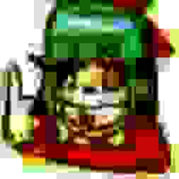

## DXMT

DXMT는 DirectX 11 기반 Windows 게임을 macOS에서 실행하기 위해 사용하는 그래픽 변환 레이어입니다.
Windows 게임은 일반적으로 Direct3D 11과 DXGI를 통해 그래픽 장치, 스왑체인, 텍스처, 셰이더, 렌더 타깃을 다룹니다.
macOS는 DirectX를 제공하지 않기 때문에, 이 호출을 Apple의 Metal API로 바꾸는 중간 계층이 필요합니다.

## 역할

DXMT의 역할은 DirectX 11 명령을 Metal 명령으로 번역하는 것입니다.
게임 입장에서는 DirectX 11 환경에서 실행되는 것처럼 보이고, macOS 입장에서는 Metal을 사용하는 프로그램처럼 동작하도록 연결합니다.

이 과정은 단순한 명령어 치환이 아닙니다.
DirectX와 Metal은 리소스 관리, 셰이더 처리, 동기화 방식, 렌더링 파이프라인 표현 방식이 다르기 때문에, DXMT는 두 API 사이의 차이를 계속 조정해야 합니다.

## DXVK와의 차이

DXVK는 DirectX 9/10/11 호출을 Vulkan으로 변환하는 대표적인 프로젝트입니다.
Linux에서는 Vulkan을 직접 사용할 수 있기 때문에 DXVK가 매우 강력한 선택지가 됩니다.

macOS에서는 상황이 다릅니다.
macOS는 Vulkan을 네이티브 API로 제공하지 않으므로, Vulkan을 다시 Metal로 변환하는 계층이 추가로 필요합니다.
이 경우 그래픽 호출 경로가 길어지고, 문제 발생 지점을 추적하기도 더 어려워질 수 있습니다.

DXMT는 DirectX 11에서 Metal로 향하는 더 직접적인 경로를 목표로 합니다.
밥똥이리호요가 DXMT를 중심으로 구성되는 이유도 이 지점에 있습니다.

## 제한 사항

DXMT가 있다고 해서 모든 DirectX 게임이 자동으로 실행되는 것은 아닙니다.
게임이 사용하는 DirectX 기능, 셰이더, 안티치트 또는 런처 구조에 따라 실행 가능 여부가 달라질 수 있습니다.
또한 게임 업데이트로 그래픽 옵션이나 렌더링 경로가 바뀌면 이전에 동작하던 설정이 더 이상 맞지 않을 수 있습니다.

프로젝트에서는 이터널 리턴과 HoYoverse 게임 실행을 우선 목표로 삼습니다.
다른 게임에서 DXMT가 동작하더라도, 해당 게임까지 공식 지원한다는 의미는 아닙니다.
