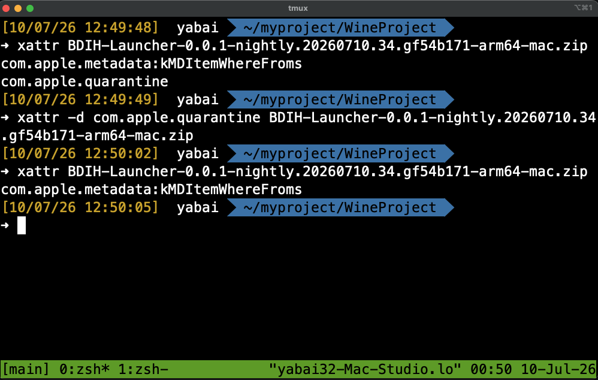
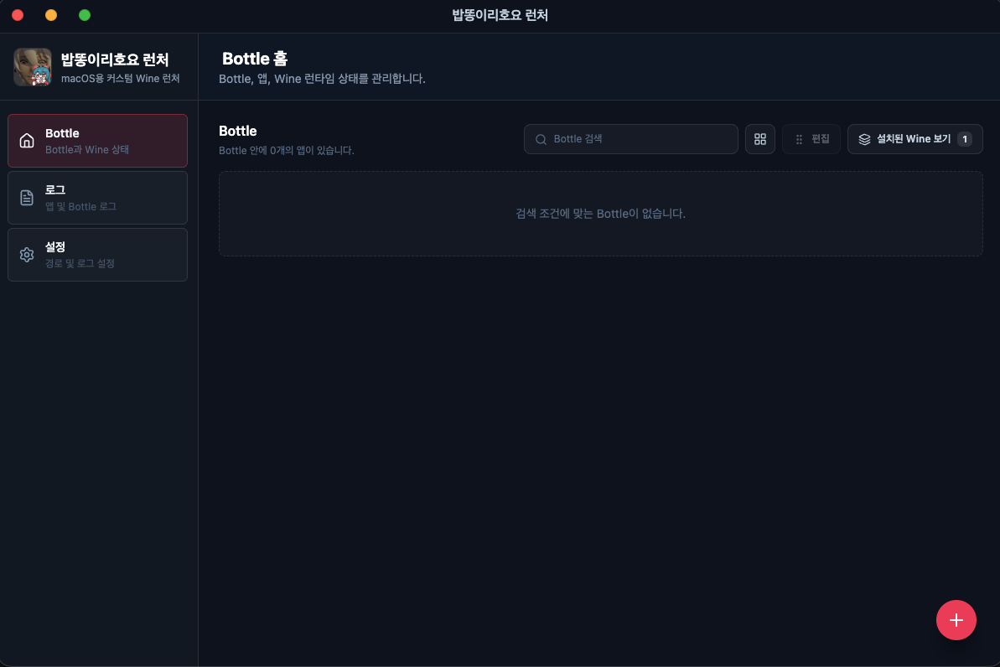

import { LinkCard } from "@astrojs/starlight/components";
import { CardGrid,Card } from "@astrojs/starlight/components";
import { Aside } from "@astrojs/starlight/components";

## 下载启动器

Bob-Ddong-Iri-Hoyo 启动器会通过 GitHub Releases 页面以 DMG 文件形式发布。
通常选择页面最上方显示的最新版本，然后下载 `.dmg` 或 `.zip` 文件即可。

## 版本类型

程序根据稳定性和更新周期提供三个版本。
<CardGrid>
  <LinkCard
    title="🟢 Stable"
    description="提供正式版和 Beta 版的默认渠道。推荐大多数用户使用。"
    href="https://github.com/Bob-Ddong-Iri-Hoyo/BDIH-Launcher/releases"
  />

  <LinkCard
    title="🟡 Staging"
    description="Stable Beta 和正式 Stable 发布前的最终验证渠道。"
    href="https://github.com/Bob-Ddong-Iri-Hoyo/BDIH-Launcher-TestProduction/releases"
  />

  <LinkCard
    title="🔴 Nightly"
    description="自动构建最新开发变更的实验渠道。"
    href="https://github.com/Bob-Ddong-Iri-Hoyo/BDIH-Launcher-nightly/releases"
  />
</CardGrid>
<Aside type="tip" title="应该安装哪个版本？">
  如果没有特别原因，请安装 **Stable 版本**。  
  Staging 和 Nightly 是用于测试的版本。
</Aside>

## 安装指南

下面的步骤以下载后的 DMG 文件为例。
路径示例需要根据你的下载位置和实际文件名替换。

### 1. 安装 Rosetta 2

<Aside type="note">
如果要在 Apple Silicon Mac 上运行基于 x86_64 的组件，可能需要 Rosetta 2。
如果已经安装了 Rosetta 2，可以跳过这一步。
</Aside>

```zsh
softwareupdate --install-rosetta --agree-to-license
```

打开 Terminal 执行命令后，macOS 会开始安装 Rosetta 2。
如果当前环境已经安装完成，命令可能不会产生额外变化并直接结束。

### 2. 移除 Quarantine 标签

<Aside type="caution">
本项目发布的构建可能没有 Apple 开发者签名和公证。
在这种状态下运行时，macOS Gatekeeper 可能会阻止应用启动，或将其显示为损坏的应用。
</Aside>
<div align="center">

</div>
macOS 会为从互联网下载的文件附加 quarantine 标签。
该标签用于安全检查，但在个人项目的未公证应用中，可能成为阻止启动的原因。
打开 Terminal、iTerm 等终端，使用下面的命令移除下载文件上的 quarantine 标签。

```zsh
xattr -d com.apple.quarantine {保存位置}/{下载的文件名}.(dmg|zip|app)
```

例如文件位于下载文件夹时，可以把 `{保存位置}` 替换为 `~/Downloads`。
如果执行命令时出现类似 `No such xattr` 的信息，表示该文件上没有需要移除的 quarantine 标签。

### 3. 安装启动器

移除 quarantine 标签后，在 Finder 中双击下载的 DMG 文件。
DMG 挂载后，按照提示将启动器应用移动到 `Applications` 文件夹，或遵循发布文件提供的安装方式。

第一次运行时，macOS 可能会再次显示确认信息。
这种情况下，可以在系统设置的隐私与安全性项目中允许运行，或在 Finder 中 Control-点击应用后选择打开。

## 应用设置与游戏安装
<div align="center">

</div>
启动应用并完成初始加载后，会显示 Bottle 列表画面。
Bottle 指 Wine 使用的独立运行环境，Windows 程序及相关设置会被分离保存在这个空间中。
<div align="center">

</div>
要创建新的 Bottle，请点击右下角的 **+** 按钮，然后选择要使用的 Wine 版本和 DXMT 版本。
如果某个游戏有推荐组合，请优先使用该组合；只有在出现问题时再切换到其他版本。
<div align="center">

</div>
<Aside type="tip">
Eternal Return 推荐使用 Wine11 或 wine-crossover-26.1.0。

HoYoverse 游戏目前只可使用 Wine 11、Wine 11.11。
</Aside>

<Aside type="caution">
所有游戏在首次运行时都可能出现一些卡顿。
这是 DXMT 或 Rosetta 2 进行缓存时产生的自然现象。
缓存完成后，这种现象之后会消失。
因此，如果是第一次运行 Eternal Return，不建议从第一局就直接进行排位赛。
</Aside>

<Aside type="tip">
Bob-Ddong-Iri-Hoyo 启动器主要以运行 Eternal Return 和 HoYoverse 游戏为目标。
对于其他所有 Steam 游戏，本项目不保证能够成功运行或保持稳定。

非支持对象游戏中出现的问题，属于预期支持范围之外的行为。
在反馈问题前，请先确认该游戏是否属于本项目的支持对象。
</Aside>

<div align="center">

</div>
