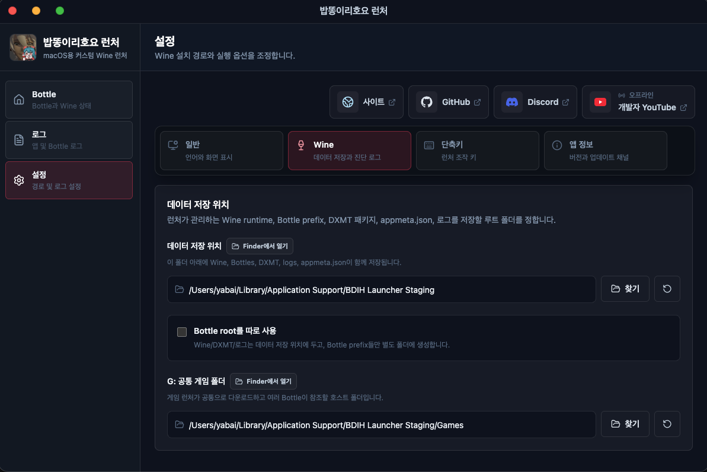

import { LinkCard } from "@astrojs/starlight/components";
import { CardGrid } from "@astrojs/starlight/components";
import { Aside } from "@astrojs/starlight/components";

## 理解 Wine Drive

所有 Windows 程序都会把路径理解为 Windows 路径。
简单来说，它们会期待类似 `C:myapp/some.exe` 这样的路径。
但 macOS 的路径不是这种形式，而是使用 `/Users/myID/some.app` 这样的 Unix/Linux 风格路径。
即使用户不需要关心，至少 Wine 必须提供 Windows 程序能够理解的路径。

## C: Drive

Wine 会把这个路径映射到 macOS 路径，供 Windows 应用使用。
例如，可以理解为 `/User/MyID/WinePrefix -> C:/` 这样的映射。

这里的 C: 表示 Windows 的 C 盘。
C 盘可以看作 Wine 指定的 macOS Path 的别名。
不过仅靠 C 盘，只能看到特定路径内部的内容。

```text
C:/Program Files/
C:/Users/
.
.
.
```

也就是说，无法访问外部的其他 macOS 文件夹或程序，只能使用映射后的 `C:/` 内部内容。

## Z: Drive

Z: 是一种别名，表示 macOS 的 Root，也就是最上层路径 `/`。
如果 C 盘处理的是映射路径内部的路径，那么 Z 盘可以表示 macOS 系统外部路径。

因此，Z: 在运行外部路径中的 Windows 应用，或管理多个 Prefix 共享的应用时很方便。
但因为 Z 盘指向最顶层路径，逐一指定完整外部路径会相当麻烦。

## G: Drive

因此，BDIH Launcher 额外提供名为 G Drive (G:) 的路径。
所有 Bottle 都可以共享使用它，并且用户可以自行指定路径。
它让用户可以使用外部任意路径，同时避免每次都指定完整路径。

进入设置中的 Wine 项目即可看到 G Drive (G:)。
多个 Bottle 可以通过这个 G: Drive 轻松保存并共享游戏。
<div align="center">

</div>

<Aside type="tip">
如图所示，把 G: Drive 设置为你想保存游戏的位置。
然后把启动器以外的游戏安装到这个空间即可。
</Aside>

<Aside type="caution">
设置 G: 路径前，必须先停止所有正在运行的 Bottle。
已经运行中的 Bottle 可能无法识别新指定的 G: Drive。
</Aside>
